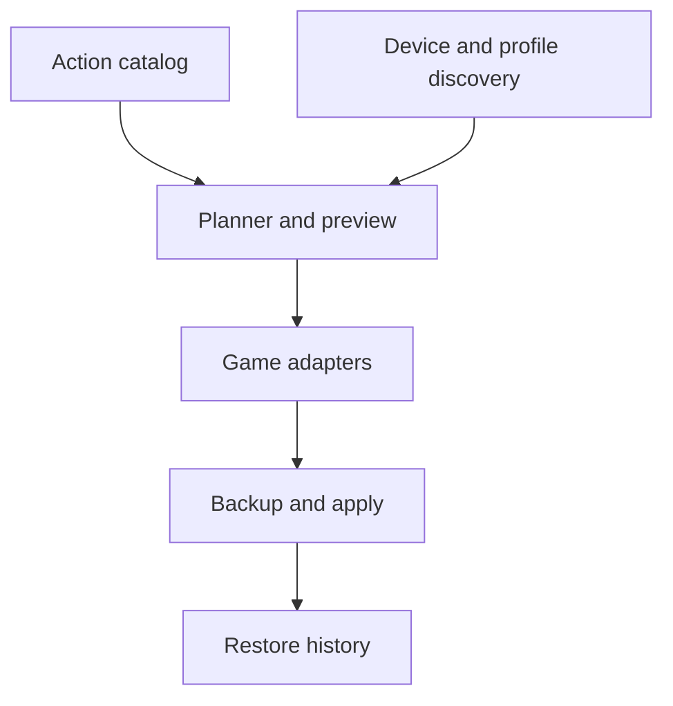

# Architecture sketch

**Status:** proposal. File layouts, action codes, and device identifiers must be learned from game-created samples; none of the illustrative identifiers below should be written to a user's configuration as-is.

## Components

| Component | Responsibility |
| --- | --- |
| Input catalog | Stable action IDs, labels, button assignments, and selected virtual-device identity |
| Device discovery | Enumerate current Windows input devices and identify the selected SimHub output |
| Game discovery | Locate installations, active user/profile files, and running processes |
| Adapter | Read a game's native format, report capabilities and existing bindings, prepare a minimal patch |
| Planner | Validate desired mappings, detect collisions, and produce a per-game preview |
| Apply engine | Back up originals, write atomically where possible, validate, and record restore data |
| Restore engine | Show dated backups and restore a selected game's selected profile |

## Application and release stack

The proof of concept is a Python 3.12+ package with no third-party runtime
dependencies. PyInstaller produces a one-file Windows console executable.
Version tags run tests, build and smoke-test the executable, generate a SHA-256
checksum, and publish both files in a GitHub Release. The packaged updater
requires that checksum before it stages an in-place replacement and relaunch.

The UI toolkit remains an open decision; the domain, adapter, safety, and
updater modules are intentionally independent of a particular desktop UI.



## Example internal model

Illustrative only; actual schema will be versioned after the first fixtures:

```json
{
  "schemaVersion": 1,
  "virtualDevice": { "provider": "simhub-control-mapper", "identity": "user-selected-device" },
  "bindings": [
    { "actionId": "pit_limiter", "virtualButton": 7 },
    { "actionId": "tc_increase", "virtualButton": 8 }
  ]
}
```

An adapter owns the mapping from `pit_limiter` to a **verified** native command. It also reports whether the command is a toggle, momentary action, or has a different meaning in that sim. Keep user-facing action IDs separate from guessed native names.

In the app-owned catalog, `virtualButton` is the positive, one-based button
number displayed by SimHub. This is only an internal/user-facing convention.
Every adapter must explicitly convert it to the button indexing used by its
tested game format; adapter code must never assume the native format has the
same base.

## Adapter contract (conceptual)

```text
discover() -> candidate profiles and files
inspect(profile) -> format version, device identity, existing bindings, capabilities
plan(profile, desired bindings) -> proposed changes, conflicts, unsupported actions
apply(plan, backup receipt) -> changed files and validation result
```

Adapters must be read-only until fixtures prove they can safely preserve unknown fields. An unknown version or ambiguous active profile blocks writes for that game and leaves other selected games available for a separate apply.

## Apply procedure

1. Locate the *active* profile, not merely a default file; require explicit selection when uncertain.
2. Refuse a write if that game's process is running or the source changed since preview.
3. Parse the exact source bytes and retain fields and files outside the requested mapping.
4. Create a timestamped backup and a receipt with original path and content hash.
5. Write a temporary file in the same directory, validate it with the adapter, then replace the original.
6. Record the result, including game version and source hash. If validation or replacement fails, restore that game's originals from the backup.

Multi-game apply is a sequence of per-game operations, **not an all-or-nothing transaction**. The UI must report partial success clearly. A restored file may later be changed again by the game or cloud sync, so restore must preview the target and warn about intervening changes.

## Safety and compatibility notes

- Windows Known Folders and game-specific discovery beat hard-coded `%USERPROFILE%\\Documents` paths, especially with OneDrive redirection.
- Game-created files are the source of truth for action codes, device identity, and per-profile behavior.
- Preserve native encoding, formatting, and unknown fields as far as the format allows. Unparseable or unsupported files stay read-only.
- Never commit personal control files: they may contain user paths, device GUIDs, or other identifying settings. Use sanitized fixtures with provenance and the game build recorded.
- Check licenses and attribution before incorporating any external codec or code.

See [research notes](RESEARCH.md) for the adapter evidence required before enabling writes.
