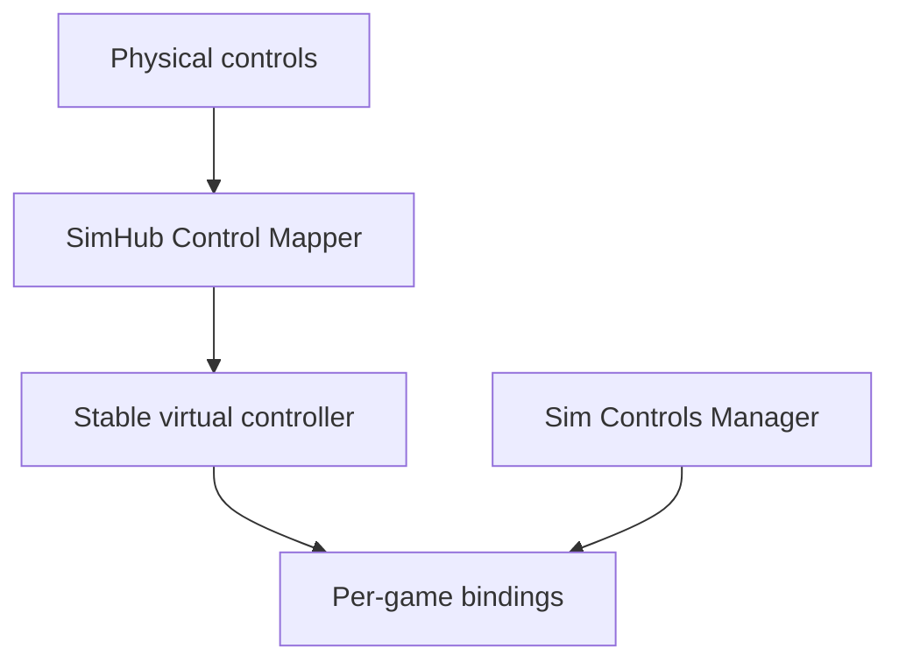

# Sim Controls Manager

One place to define button actions and apply supported bindings across PC racing simulators.

**Status:** planning and format research. No game adapter or SimHub automation has been implemented or validated yet.

## The problem

A wheel, button box, and Stream Deck may expose different button numbers to every sim. Rebinding `Pit Limiter`, `TC +`, and other actions in each game is repetitive, especially when hardware changes.

The proposed app lets a driver define a stable action catalog, connect each action to a SimHub Control Mapper role and virtual button, then preview and apply the corresponding bindings in supported games. Each game's actual action name and configuration format is handled by its own adapter. An action is shown as unavailable when a game does not expose a verified equivalent.

The manager initially **reads** the SimHub role-to-button assignment or accepts it from the user; automatically writing SimHub's configuration is a separate research task. Steering, pedals, calibration, and force feedback remain game-native in the initial scope. SimHub documents roles, a vJoy output, and an Arduino bridge: [Control Mapper documentation](https://github.com/SHWotever/SimHub/wiki/Control-Mapper-plugin).

## Target games

| Game | Initial investigation | Planned first level of support |
| --- | --- | --- |
| iRacing | Binary control settings and active control profiles | Validate read/write round trip, then selected buttons |
| Assetto Corsa | INI controls and saved presets | Selected buttons |
| Assetto Corsa Competizione | JSON controls and saved presets | Selected buttons after schema validation |
| Le Mans Ultimate | JSON input files, GameInput versus DirectInput | Selected buttons after device tests |
| Assetto Corsa EVO | Settings moved to `Saved Games/ACE`; binding schema unverified | Discovery and backup only until proven writable |
| Automobilista 2 | Controller settings `.sav` and in-game profiles | Discovery and backup only until proven writable |

These are **targets, not promises of working adapters**. The earlier assumption that AMS2 only had a single profile is outdated: multiple in-game profiles were added. iRacing also introduced native control profiles in 2026. See [research notes](docs/RESEARCH.md).

## Intended workflow

1. Select a known SimHub virtual controller and confirm its button numbers.
2. Assign stable action IDs such as `pit_limiter` to virtual buttons.
3. Detect installed games and enumerate their profiles and control files.
4. Preview the exact per-game changes, unsupported actions, and conflicts.
5. Apply only to supported games while they are closed; create restorable backups first.
6. Test in each game's control menu, then on track.

## Project documents

- [Goals and scope](docs/GOALS.md)
- [Architecture and safety rules](docs/ARCHITECTURE.md)
- [Prioritized to-do list](TODO.md)
- [Research and evidence checklist](docs/RESEARCH.md)
- [Contribution guide](CONTRIBUTING.md)

## First milestone

Build a Windows proof of concept for **one game and three button actions**: discover its active controls file, preview a mapping change, apply it after making a backup, reopen the game to verify the binding, and restore the original file. Game choice depends on real samples and a successful format round trip.

## Existing work and references

- [SimHub Control Mapper](https://github.com/SHWotever/SimHub/wiki/Control-Mapper-plugin) documents roles and virtual outputs.
- [iRacing Controls Editor](https://github.com/jackhumbert/iracing-controls-editor-app) demonstrates editing `controls.cfg` outside the sim.
- [Content Manager's AC control settings implementation](https://github.com/gro-ove/actools/blob/master/AcManager.Tools/Helpers/AcSettings/ControlsSettings.cs) is a starting point for studying Assetto Corsa's INI settings.
- [iRacing's May 2026 development update](https://www.iracing.com/iracing-development-update-may-2026/) announces native control profiles.

This is an independent project and is not affiliated with the game or hardware vendors. No license has been chosen yet; select one after reviewing dependencies and any code reused from other projects.
