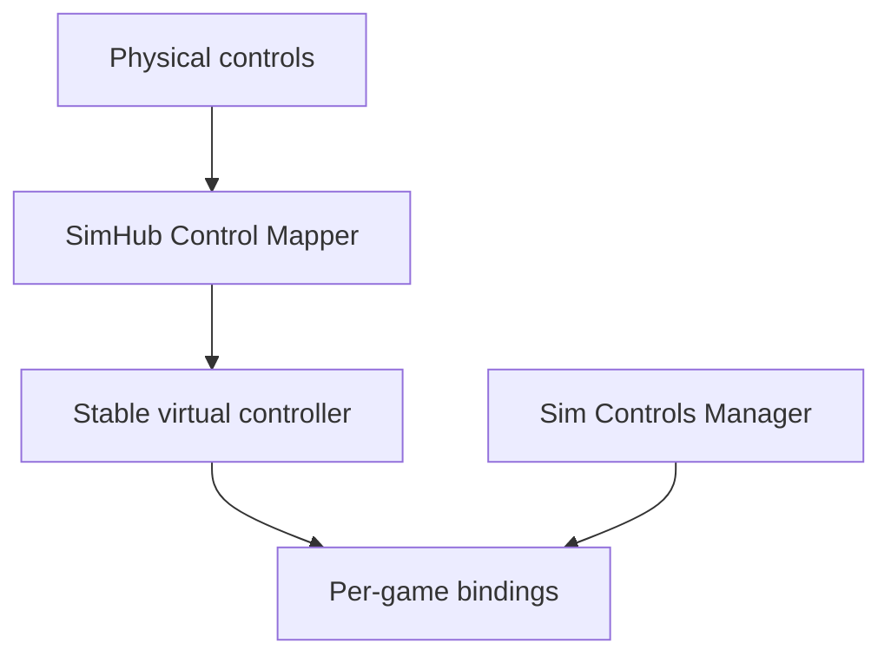

# Sim Controls Manager

One place to define button actions and apply supported bindings across PC racing simulators.

**Status:** Python proof of concept. Manual catalogs, guarded file operations,
release/self-update plumbing, and read-only iRacing profile inspection are
implemented. No game adapter is permitted to write bindings yet.

## The problem

A wheel, button box, and Stream Deck may expose different button numbers to every sim. Rebinding `Pit Limiter`, `TC +`, and other actions in each game is repetitive, especially when hardware changes.

The proposed app lets a driver define a stable action catalog, connect each action to a SimHub Control Mapper role and virtual button, then preview and apply the corresponding bindings in supported games. Each game's actual action name and configuration format is handled by its own adapter. An action is shown as unavailable when a game does not expose a verified equivalent.



The manager initially **reads** the SimHub role-to-button assignment or accepts it from the user; automatically writing SimHub's configuration is a separate research task. Steering, pedals, calibration, and force feedback remain game-native in the initial scope. SimHub documents roles, a vJoy output, and an Arduino bridge: [Control Mapper documentation](https://github.com/SHWotever/SimHub/wiki/Control-Mapper-plugin).

## Target games

| Game | Initial investigation | Planned first level of support |
| --- | --- | --- |
| iRacing | Binary control settings and active control profiles | Read-only discovery and inspection implemented; writes remain gated |
| Assetto Corsa | INI controls and saved presets | Selected buttons |
| Assetto Corsa Competizione | JSON controls and saved presets | Selected buttons after schema validation |
| Le Mans Ultimate | JSON input files, GameInput versus DirectInput | Selected buttons after device tests |
| Assetto Corsa EVO | Settings moved to `Saved Games/ACE`; binding schema unverified | Discovery and backup only until proven writable |
| Automobilista 2 | Controller settings `.sav` and in-game profiles | Discovery and backup only until proven writable |

These are **targets, not promises of working adapters**. The earlier assumption that AMS2 only had a single profile is outdated: multiple in-game profiles were added. iRacing also introduced native control profiles in 2026. See [research notes](RESEARCH.md).

## Intended workflow

1. Select a known SimHub virtual controller and confirm its button numbers.
2. Assign stable action IDs such as `pit_limiter` to virtual buttons.
3. Detect installed games and enumerate their profiles and control files.
4. Preview the exact per-game changes, unsupported actions, and conflicts.
5. Apply only to supported games while they are closed; create restorable backups first.
6. Test in each game's control menu, then on track.

## Project documents

- [Goals and scope](GOALS.md)
- [Architecture and safety rules](ARCHITECTURE.md)
- [Prioritized to-do list](TODO.md)
- [Research and evidence checklist](RESEARCH.md)
- [Contribution guide](CONTRIBUTING.md)

## Development

The first code chunk is a dependency-free domain module for the versioned,
manually configured action catalog. It defines the three proof-of-concept
actions and rejects unknown schema versions, unsupported actions, duplicate
actions, and duplicate virtual-button assignments.

The safety module can also plan a byte-exact file replacement, detect changes
since preview, create a hash-verified backup and receipt, roll back a failed
post-write validation, preview a restore, and refuse to overwrite intervening
changes. It is adapter-independent; no game writes are enabled until a tested
adapter supplies native-format validation.

Requirements for development: Python 3.12 or newer. Create an environment,
install the project, and run the tests with:

```powershell
python -m venv .venv
.venv\Scripts\Activate.ps1
python -m pip install -e ".[dev]"
python -m pytest
```

See [`examples/catalog.example.json`](examples/catalog.example.json) for the
current catalog shape. `virtualButton` is the positive, one-based number shown
by SimHub; each game adapter is responsible for translating that number to the
game's verified native convention.

Validate a catalog without changing it or any game files:

```powershell
python -m sim_controls_manager catalog validate examples/catalog.example.json
```

The first adapter reuses the proven active-profile and binary-format research
from the MIT-licensed iRacing Config Tracker. It is intentionally read-only:

```powershell
python -m sim_controls_manager iracing discover
python -m sim_controls_manager iracing inspect
python -m sim_controls_manager iracing inspect --profile Oval
```

Discovery handles both legacy top-level `controls.cfg` and current
`profiles\controls\<name>\controls.cfg` layouts. Inspection must reproduce the
entire binary file byte-for-byte before it reports `PitSpeedLimiter`,
`TractionControlInc`, or `TractionControlDec`. This does not yet enable writes;
device selection and an in-game test are still required.

## Windows executable and updates

The release workflow builds a self-contained, console-based
`SimControlsManager.exe` with PyInstaller. End users do not need Python. A
version tag publishes the executable and its SHA-256 checksum to a GitHub
Release:

```powershell
git tag v0.1.0
git push origin v0.1.0
```

The workflow can also be run manually from GitHub's **Actions** tab; manual
runs produce downloadable build artifacts without publishing a release. Build
the same files locally with:

```powershell
powershell -ExecutionPolicy Bypass -File packaging\build-exe.ps1
```

The packaged executable checks the latest release or installs it with:

```powershell
SimControlsManager.exe update check
SimControlsManager.exe update install
```

Installation is only enabled in the packaged executable. It requires both
`SimControlsManager.exe` and `SimControlsManager.exe.sha256` from the release,
verifies the checksum, replaces the executable after the current process
closes, and relaunches it. An executable in a protected directory prompts for
administrator permission only when replacement requires it.

## First milestone

Build a Windows proof of concept for **one game and three button actions**: discover its active controls file, preview a mapping change, apply it after making a backup, reopen the game to verify the binding, and restore the original file. Game choice depends on real samples and a successful format round trip.

## Existing work and references

- [SimHub Control Mapper](https://github.com/SHWotever/SimHub/wiki/Control-Mapper-plugin) documents roles and virtual outputs.
- [iRacing Controls Editor](https://github.com/jackhumbert/iracing-controls-editor-app) demonstrates editing `controls.cfg` outside the sim.
- [Content Manager's AC control settings implementation](https://github.com/gro-ove/actools/blob/master/AcManager.Tools/Helpers/AcSettings/ControlsSettings.cs) is a starting point for studying Assetto Corsa's INI settings.
- [iRacing's May 2026 development update](https://www.iracing.com/iracing-development-update-may-2026/) announces native control profiles.

This is an independent project and is not affiliated with the game or hardware vendors. No license has been chosen yet; select one after reviewing dependencies and any code reused from other projects.
See [third-party notices](THIRD_PARTY_NOTICES.md) for reused MIT-licensed work.
