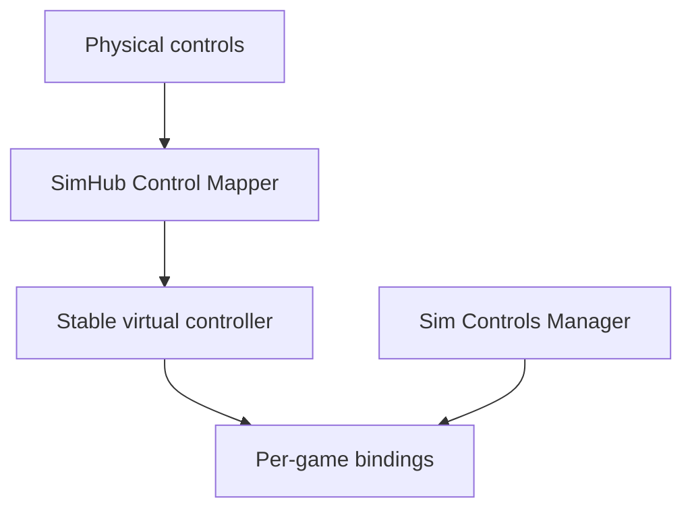

# Sim Controls Manager

One place to define button actions and apply supported bindings across PC racing simulators.

The normalized control vocabulary across all six inventoried simulators is
documented in [BASIC_CONTROL_MAP.md](BASIC_CONTROL_MAP.md) and
[COMMON_CONTROL_MAP.md](COMMON_CONTROL_MAP.md), with the third 50-control batch
in [ADVANCED_CONTROL_MAP.md](ADVANCED_CONTROL_MAP.md). Completed and remaining
work is tracked in [CONTROL_MAPPING_STATUS.md](CONTROL_MAPPING_STATUS.md).
Batch 4 is in [TUNING_CONTROL_MAP.md](TUNING_CONTROL_MAP.md), and Batch 5 is in
[SYSTEM_CONTROL_MAP.md](SYSTEM_CONTROL_MAP.md). The final core/utility batch is
in [CORE_UTILITY_CONTROL_MAP.md](CORE_UTILITY_CONTROL_MAP.md). The
positional/extended batch is in
[EXTENDED_CONTROL_MAP.md](EXTENDED_CONTROL_MAP.md), and the camera batch is in
[CAMERA_CONTROL_MAP.md](CAMERA_CONTROL_MAP.md). The final advanced camera and
replay batch is in [MEDIA_CONTROL_MAP.md](MEDIA_CONTROL_MAP.md). The full
structured vocabulary is available from `sim_controls_manager.control_names`.

**Status:** Windows GUI proof of concept. SimHub mapping inspection, guarded iRacing
three-action writes, verified restore, Windows packaging, and release/self-update
plumbing are implemented. Real vJoy and in-game validation remain before the
first adapter is considered complete.

## Desktop app

Launch the modern desktop interface with no arguments:

```powershell
python -m sim_controls_manager
```

The app discovers iRacing profiles, reads the three supported SimHub Control
Mapper roles, lists connected DirectInput controllers, previews exact binding
changes, and applies them through the same verified backup and rollback path as
the CLI. Live sync watches the SimHub settings file, iRacing profile files and
active-profile selector, and connected controller identities every few seconds.
Changes are rescanned and re-previewed automatically; they are never applied
without explicit confirmation. The Recovery screen previews a receipt before
restoring its backup.

## The problem

A wheel, button box, and Stream Deck may expose different button numbers to every sim. Rebinding `Pit Limiter`, `TC +`, and other actions in each game is repetitive, especially when hardware changes.

The proposed app lets a driver define a stable action catalog, connect each action to a SimHub Control Mapper role and virtual button, then preview and apply the corresponding bindings in supported games. Each game's actual action name and configuration format is handled by its own adapter. An action is shown as unavailable when a game does not expose a verified equivalent.



The manager **reads** the SimHub role-to-button assignment or accepts it from
the user; automatically writing SimHub's configuration is a separate research
task. Steering, pedals, calibration, and force feedback remain game-native in
the initial scope. SimHub documents roles, a vJoy output, and an Arduino bridge:
[Control Mapper documentation](https://github.com/SHWotever/SimHub/wiki/Control-Mapper-plugin).

## Target games

| Game | Initial investigation | Planned first level of support |
| --- | --- | --- |
| iRacing | Binary control settings and active control profiles | Guarded three-action preview/apply/restore implemented; real vJoy and in-game verification pending |
| Assetto Corsa | INI controls and saved presets | Selected buttons |
| Assetto Corsa Competizione | JSON controls and saved presets | Selected buttons after schema validation |
| Le Mans Ultimate | JSON input files, GameInput versus DirectInput | Selected buttons after device tests |
| Assetto Corsa EVO | Settings moved to `Saved Games/ACE`; binding schema unverified | Discovery and backup only until proven writable |
| Automobilista 2 | Controller settings `.sav` and in-game profiles | Discovery and backup only until proven writable |

These are **targets, not promises of working adapters**. The earlier assumption that AMS2 only had a single profile is outdated: multiple in-game profiles were added. iRacing also introduced native control profiles in 2026. See [research notes](RESEARCH.md).

## Intended workflow

1. Select a known SimHub virtual controller and confirm its button numbers.
2. Assign stable action IDs such as `pit_limiter` to virtual buttons.
3. Detect installed games and enumerate their profiles and control files.
4. Preview the exact per-game changes, unsupported actions, and conflicts.
5. Apply only to supported games while they are closed; create restorable backups first.
6. Test in each game's control menu, then on track.

## Project documents

- [Goals and scope](GOALS.md)
- [Architecture and safety rules](ARCHITECTURE.md)
- [Prioritized to-do list](TODO.md)
- [Research and evidence checklist](RESEARCH.md)
- [Contribution guide](CONTRIBUTING.md)

## Development

The first code chunk is a dependency-free domain module for the versioned,
manually configured action catalog. It defines the three proof-of-concept
actions and rejects unknown schema versions, unsupported actions, duplicate
actions, and duplicate virtual-button assignments.

The safety module can also plan a byte-exact file replacement, detect changes
since preview, create a hash-verified backup and receipt, roll back a failed
post-write validation, preview a restore, and refuse to overwrite intervening
changes. It is adapter-independent; no game writes are enabled until a tested
adapter supplies native-format validation.

Requirements for development: Python 3.12 or newer. Create an environment,
install the project, and run the tests with:

```powershell
python -m venv .venv
.venv\Scripts\Activate.ps1
python -m pip install -e ".[dev]"
python -m pytest
```

See [`examples/catalog.example.json`](examples/catalog.example.json) for the
current catalog shape. `virtualButton` is the positive, one-based number shown
by SimHub; each game adapter is responsible for translating that number to the
game's verified native convention.

Validate a catalog without changing it or any game files:

```powershell
python -m sim_controls_manager catalog validate examples/catalog.example.json
```

The first adapter reuses the proven active-profile and binary-format research
from the MIT-licensed iRacing Config Tracker. It is intentionally read-only:

```powershell
python -m sim_controls_manager iracing discover
python -m sim_controls_manager iracing inspect
python -m sim_controls_manager iracing inspect --profile Oval
```

Discovery handles both legacy top-level `controls.cfg` and current
`profiles\controls\<name>\controls.cfg` layouts. Inspection must reproduce the
entire binary file byte-for-byte before it reports `PitSpeedLimiter`,
`TractionControlInc`, or `TractionControlDec`. Writes require an exact
DirectInput device identity, a preview, and explicit confirmation.

### Three-action iRacing core

The first writable slice is intentionally limited to:

- `pit_limiter` → `PitSpeedLimiter`
- `tc_increase` → `TractionControlInc`
- `tc_decrease` → `TractionControlDec`

Start SimHub and enable its virtual DirectInput output, then list the exact
device identity iRacing needs:

```powershell
SimControlsManagerCLI.exe simhub inspect
SimControlsManagerCLI.exe iracing devices
```

`simhub inspect` reads Control Mapper's settings without changing them. On the
current test rig it detects pit limiter on button 20, TC increase on button 8,
and TC decrease on button 7. The example catalog contains those verified button
numbers. `iracing devices` must still see the virtual controller so its exact,
machine-specific GUIDs can be copied safely.

Copy that device's `instanceGuid` and `productGuid` into the catalog's
`virtualDevice` object, alongside the three SimHub button numbers:

```json
{
  "provider": "simhub-control-mapper",
  "identity": "Exact device name shown by the devices command",
  "instanceGuid": "PASTE-INSTANCE-GUID-HERE",
  "productGuid": "PASTE-PRODUCT-GUID-HERE"
}
```

SimHub numbers buttons from 1; the verified iRacing file stores the equivalent
button index from 0. The adapter performs that conversion explicitly (for
example, SimHub button 7 previews as iRacing `Btn 6`).

Use a non-active test profile first. Previewing never writes:

```powershell
SimControlsManagerCLI.exe iracing plan --profile Test --catalog examples\catalog.example.json
```

Applying shows the same preview, rejects conflicts and running iRacing
processes, writes a verified backup, validates the result, and prints a restore
receipt:

```powershell
SimControlsManagerCLI.exe iracing apply --profile Test --catalog examples\catalog.example.json --yes
SimControlsManagerCLI.exe iracing restore <receipt-path>
```

Writing the active profile is blocked unless `--allow-active-profile` is also
provided. A second apply is a no-op when all three bindings already match.

## Windows executable and updates

The release workflow builds a self-contained, windowed
`SimControlsManager.exe` with PyInstaller. It opens only the app—there is no
extra console window. The release also includes `SimControlsManagerCLI.exe` for
command-line workflows. End users do not need Python. A successful push to
`main` or `master` publishes both executables and their SHA-256 checksums to a
GitHub Release, using an automatic version such as `v0.1.42`.
Pushing an explicit version tag publishes that version instead:

```powershell
git tag v0.1.0
git push origin v0.1.0
```

Pull requests and manual runs from GitHub's **Actions** tab produce downloadable
build artifacts without publishing a release. Build the same files locally
with:

```powershell
powershell -ExecutionPolicy Bypass -File packaging\build-exe.ps1
```

The packaged executable checks the latest release or installs it with:

```powershell
SimControlsManagerCLI.exe update check
SimControlsManagerCLI.exe update install
```

Installation is only enabled in the packaged executable. It requires both
`SimControlsManager.exe` and `SimControlsManager.exe.sha256` from the release,
verifies the checksum, replaces the executable after the current process
closes, and relaunches it. An executable in a protected directory prompts for
administrator permission only when replacement requires it.

## First milestone

Build a Windows proof of concept for **one game and three button actions**: discover its active controls file, preview a mapping change, apply it after making a backup, reopen the game to verify the binding, and restore the original file. Game choice depends on real samples and a successful format round trip.

## Existing work and references

- [SimHub Control Mapper](https://github.com/SHWotever/SimHub/wiki/Control-Mapper-plugin) documents roles and virtual outputs.
- [iRacing Controls Editor](https://github.com/jackhumbert/iracing-controls-editor-app) demonstrates editing `controls.cfg` outside the sim.
- [Content Manager's AC control settings implementation](https://github.com/gro-ove/actools/blob/master/AcManager.Tools/Helpers/AcSettings/ControlsSettings.cs) is a starting point for studying Assetto Corsa's INI settings.
- [iRacing's May 2026 development update](https://www.iracing.com/iracing-development-update-may-2026/) announces native control profiles.

This is an independent project and is not affiliated with the game or hardware vendors. No license has been chosen yet; select one after reviewing dependencies and any code reused from other projects.
See [third-party notices](THIRD_PARTY_NOTICES.md) for reused MIT-licensed work.
