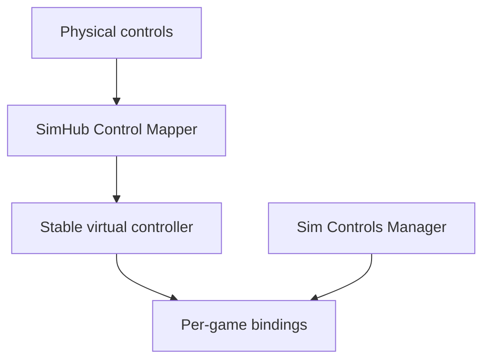

# Sim Controls Manager

One place to define button actions and apply supported bindings across PC racing simulators.

The normalized control vocabulary across all six inventoried simulators is
documented in [BASIC_CONTROL_MAP.md](BASIC_CONTROL_MAP.md) and
[COMMON_CONTROL_MAP.md](COMMON_CONTROL_MAP.md), with the third 50-control batch
in [ADVANCED_CONTROL_MAP.md](ADVANCED_CONTROL_MAP.md). Completed and remaining
work is tracked in [CONTROL_MAPPING_STATUS.md](CONTROL_MAPPING_STATUS.md).
Batch 4 is in [TUNING_CONTROL_MAP.md](TUNING_CONTROL_MAP.md), and Batch 5 is in
[SYSTEM_CONTROL_MAP.md](SYSTEM_CONTROL_MAP.md). The final core/utility batch is
in [CORE_UTILITY_CONTROL_MAP.md](CORE_UTILITY_CONTROL_MAP.md). The
positional/extended batch is in
[EXTENDED_CONTROL_MAP.md](EXTENDED_CONTROL_MAP.md), and the camera batch is in
[CAMERA_CONTROL_MAP.md](CAMERA_CONTROL_MAP.md). The final advanced camera and
replay batch is in [MEDIA_CONTROL_MAP.md](MEDIA_CONTROL_MAP.md). The full
structured vocabulary is available from `sim_controls_manager.control_names`.

**Status:** Windows GUI proof of concept with five provisional, write-capable
adapters: iRacing, Assetto Corsa, Assetto Corsa Competizione, Assetto Corsa
EVO, and Le Mans Ultimate. Each adapter
uses preview, conflict checks, process guards, verified backup, guarded apply,
and receipt-based restore. Real SimHub virtual-device and in-game validation
remain before any adapter is considered production-complete.

## Desktop app

Launch the modern desktop interface with no arguments:

```powershell
python -m sim_controls_manager
```

The app discovers iRacing, Assetto Corsa, ACC, AC EVO, and Le Mans Ultimate control profiles, reads the
three supported SimHub Control Mapper roles, lists connected DirectInput
controllers, previews exact binding changes, and applies them through the same
verified backup and rollback path as the CLI. Live sync watches the simulator
control files, SimHub settings, profile selection, and connected controller
identities every few seconds. Changes are rescanned and re-previewed
automatically; they are never applied without explicit confirmation. The
Recovery screen previews a receipt before restoring its backup.

The **Tablet shortcuts** screen is intentionally limited to button actions for
a SimHub tablet/button-deck workflow. Steering, throttle, brake, clutch,
handbrake, paddle shifts, and direct gears are excluded from that browser.

## The problem

A wheel, button box, and Stream Deck may expose different button numbers to every sim. Rebinding `Pit Limiter`, `TC +`, and other actions in each game is repetitive, especially when hardware changes.

The proposed app lets a driver define a stable action catalog, connect each action to a SimHub Control Mapper role and virtual button, then preview and apply the corresponding bindings in supported games. Each game's actual action name and configuration format is handled by its own adapter. An action is shown as unavailable when a game does not expose a verified equivalent.



The manager **reads** the SimHub role-to-button assignment or accepts it from
the user; automatically writing SimHub's configuration is a separate research
task. Steering, pedals, calibration, and force feedback remain game-native in
the initial scope. SimHub documents roles, a vJoy output, and an Arduino bridge:
[Control Mapper documentation](https://github.com/SHWotever/SimHub/wiki/Control-Mapper-plugin).

## Adapter status

The control-name crosswalk covers all six games, but a name in the crosswalk is
not the same thing as a working adapter. The current implementation status is:

| Game | Adapter status | Implemented shortcut support | Remaining work |
| --- | --- | --- | --- |
| iRacing | **Built — provisional** | Discovers legacy and native profiles; inspects, previews, applies, and restores `PitSpeedLimiter`, `TractionControlInc`, and `TractionControlDec` in the binary GFCC format | Verify a real SimHub virtual controller and all three writes in game |
| Assetto Corsa | **Built — provisional** | Discovers live controls and saved INI presets; previews, applies, and restores `[TCUP]` and `[TCDN]`; pit limiter is correctly reported as not exposed | Verify the virtual-controller `JOY` index and both shortcuts in game |
| Assetto Corsa Competizione | **Built — provisional** | Discovers and validates live JSON; previews, applies, and restores `PitLimiter`, `IncreaseTC`, and `DecreaseTC` on a selected non-pedal device | Register the SimHub virtual controller in ACC and verify all three shortcuts in game |
| Assetto Corsa EVO | **Built — experimental** | Decodes the installed protobuf descriptor and live device mapping; previews, applies, and restores `InputAction_Car_Pit_Limiter_Toggle` plus payloads 1/2 of `InputAction_Car_TractionControl_Cycle_X_2` | Register the SimHub DirectInput device in game, then verify button indexing and TC payload direction in AC EVO before treating writes as validated |
| Automobilista 2 | **Needs adapter** | Installed control labels are inventoried for the crosswalk only | Decode the protected/binary `.sav` controller format and its multi-profile behavior before enabling writes |
| Le Mans Ultimate | **Built — provisional** | Discovers JSON controller presets; previews, applies, and restores `Speed Limiter`, `Traction Control Up`, and `Traction Control Down` on the selected non-pedal SimHub device | Create a user preset containing the SimHub controller and verify device identity, the `32 + button - 1` DirectInput ID translation, and all three shortcuts in game |

“Built — provisional” means the adapter code, tests, GUI/CLI workflow, backup,
apply, and restore paths exist. It does **not** yet mean production-ready or
fully verified in the simulator. See [research notes](RESEARCH.md) for the
evidence required to promote an adapter beyond provisional status.

## Intended workflow

1. Select a known SimHub virtual controller and confirm its button numbers.
2. Assign stable action IDs such as `pit_limiter` to virtual buttons.
3. Detect installed games and enumerate their profiles and control files.
4. Preview the exact per-game changes, unsupported actions, and conflicts.
5. Apply only to supported games while they are closed; create restorable backups first.
6. Test in each game's control menu, then on track.

## Project documents

- [Goals and scope](GOALS.md)
- [Architecture and safety rules](ARCHITECTURE.md)
- [Prioritized to-do list](TODO.md)
- [Research and evidence checklist](RESEARCH.md)
- [Contribution guide](CONTRIBUTING.md)

## Development

The first code chunk is a dependency-free domain module for the versioned,
manually configured action catalog. It defines the three proof-of-concept
actions and rejects unknown schema versions, unsupported actions, duplicate
actions, and duplicate virtual-button assignments.

The safety module can plan a byte-exact file replacement, detect changes
since preview, create a hash-verified backup and receipt, roll back a failed
post-write validation, preview a restore, and refuse to overwrite intervening
changes. It is adapter-independent; game writes are enabled only when an
adapter supplies native-format validation and a process guard.

Requirements for development: Python 3.12 or newer. Create an environment,
install the project, and run the tests with:

```powershell
python -m venv .venv
.venv\Scripts\Activate.ps1
python -m pip install -e ".[dev]"
python -m pytest
```

See [`examples/catalog.example.json`](examples/catalog.example.json) for the
current catalog shape. `virtualButton` is the positive, one-based number shown
by SimHub; each game adapter is responsible for translating that number to the
game's verified native convention.

Validate a catalog without changing it or any game files:

```powershell
python -m sim_controls_manager catalog validate examples/catalog.example.json
```

The first adapter reuses the proven active-profile and binary-format research
from the MIT-licensed iRacing Config Tracker. Discovery and inspection are
read-only:

```powershell
python -m sim_controls_manager iracing discover
python -m sim_controls_manager iracing inspect
python -m sim_controls_manager iracing inspect --profile Oval
```

Discovery handles both legacy top-level `controls.cfg` and current
`profiles\controls\<name>\controls.cfg` layouts. Inspection must reproduce the
entire binary file byte-for-byte before it reports `PitSpeedLimiter`,
`TractionControlInc`, or `TractionControlDec`. Writes require an exact
DirectInput device identity, a preview, and explicit confirmation.

### Three-action iRacing core

The first writable slice is intentionally limited to:

- `pit_limiter` → `PitSpeedLimiter`
- `tc_increase` → `TractionControlInc`
- `tc_decrease` → `TractionControlDec`

Start SimHub and enable its virtual DirectInput output, then list the exact
device identity iRacing needs:

```powershell
SimControlsManagerCLI.exe simhub inspect
SimControlsManagerCLI.exe iracing devices
```

`simhub inspect` reads Control Mapper's settings without changing them. On the
current test rig it detects pit limiter on button 20, TC increase on button 8,
and TC decrease on button 7. The example catalog contains those verified button
numbers. `iracing devices` must still see the virtual controller so its exact,
machine-specific GUIDs can be copied safely.

Copy that device's `instanceGuid` and `productGuid` into the catalog's
`virtualDevice` object, alongside the three SimHub button numbers:

```json
{
  "provider": "simhub-control-mapper",
  "identity": "Exact device name shown by the devices command",
  "instanceGuid": "PASTE-INSTANCE-GUID-HERE",
  "productGuid": "PASTE-PRODUCT-GUID-HERE"
}
```

SimHub numbers buttons from 1; the verified iRacing file stores the equivalent
button index from 0. The adapter performs that conversion explicitly (for
example, SimHub button 7 previews as iRacing `Btn 6`).

Use a non-active test profile first. Previewing never writes:

```powershell
SimControlsManagerCLI.exe iracing plan --profile Test --catalog examples\catalog.example.json
```

Applying shows the same preview, rejects conflicts and running iRacing
processes, writes a verified backup, validates the result, and prints a restore
receipt:

```powershell
SimControlsManagerCLI.exe iracing apply --profile Test --catalog examples\catalog.example.json --yes
SimControlsManagerCLI.exe iracing restore <receipt-path>
```

Writing the active profile is blocked unless `--allow-active-profile` is also
provided. A second apply is a no-op when all three bindings already match.

### Assetto Corsa adapter

The second adapter discovers the live `cfg\controls.ini` and saved controller
presets, then losslessly inspects and updates Assetto Corsa's verified traction
control actions:

- `tc_increase` → `[TCUP]`
- `tc_decrease` → `[TCDN]`

Assetto Corsa does not expose a pit-limiter action in the inspected control
vocabulary, so `pit_limiter` is reported as unavailable and is never guessed.
The adapter resolves the selected virtual controller's `JOY` index from
`[CONTROLLERS]`, converts SimHub's one-based button number to AC's zero-based
`BUTTON`, detects existing button and H-shifter conflicts, and preserves the
original encoding, BOM, line endings, ordering, and unrelated settings.

```powershell
SimControlsManagerCLI.exe assetto-corsa discover
SimControlsManagerCLI.exe assetto-corsa inspect
SimControlsManagerCLI.exe assetto-corsa plan --catalog examples\catalog.example.json
SimControlsManagerCLI.exe assetto-corsa apply --catalog examples\catalog.example.json --yes --allow-active-profile
SimControlsManagerCLI.exe assetto-corsa restore <receipt-path>
```

Use a saved test preset by passing `--profile <name>` to plan or apply. Writes
to the live controls file require both `--yes` and `--allow-active-profile`, and
Assetto Corsa must be closed. The desktop app exposes the same workflow through
the simulator selector on the Bindings page.

### Assetto Corsa Competizione adapter

The ACC adapter is shortcut-only: it updates `PitLimiter`, `IncreaseTC`, and
`DecreaseTC` in the selected non-pedal virtual device's
`raceCommandButtonList`. It never modifies `raceCommandAxisList`, steering,
pedal, or shifting data. Existing unrelated JSON fields and device mappings are
retained, and an occupied virtual button blocks the write.

```powershell
SimControlsManagerCLI.exe acc discover
SimControlsManagerCLI.exe acc inspect
SimControlsManagerCLI.exe acc plan --catalog examples\catalog.example.json
SimControlsManagerCLI.exe acc apply --catalog examples\catalog.example.json --yes --allow-active-profile
SimControlsManagerCLI.exe acc restore <receipt-path>
```

ACC must already list the SimHub virtual controller in `commandDevices`; launch
the game and select/detect that controller once before applying shortcuts. ACC
must be closed for apply and restore operations.

### Assetto Corsa EVO adapter

The experimental AC EVO adapter decodes
`Saved Games\ACE\input_devices.inputdeviceconfiguration` using the protobuf
message definitions embedded in the installed game executable. It is limited
to the same three tablet shortcuts:

- `pit_limiter` → `InputAction_Car_Pit_Limiter_Toggle`
- `tc_increase` → payload 1 of `InputAction_Car_TractionControl_Cycle_X_2`
- `tc_decrease` → payload 2 of `InputAction_Car_TractionControl_Cycle_X_2`

It requires an existing, uniquely identifiable SimHub DirectInput controller
record, converts SimHub's one-based button number to the game's zero-based
index, rejects XInput and pedal devices, and preserves unrelated protobuf
fields, axes, shifts, and commands. AC EVO currently exposes only a live device
mapping, so apply requires both confirmation flags:

```powershell
SimControlsManagerCLI.exe assetto-corsa-evo discover
SimControlsManagerCLI.exe assetto-corsa-evo inspect
SimControlsManagerCLI.exe assetto-corsa-evo plan --catalog examples\catalog.example.json
SimControlsManagerCLI.exe assetto-corsa-evo apply --catalog examples\catalog.example.json --yes --allow-active-profile
SimControlsManagerCLI.exe assetto-corsa-evo restore <receipt-path>
```

This adapter remains **experimental** until the payload direction and resulting
bindings are checked in AC EVO's controls screen and on track. Preview, backup,
validation, process guard, rollback, and restore are implemented.

### Le Mans Ultimate adapter

The LMU adapter discovers `UserData\Controller\Presets\*.JSON` inside the game
installation and requires you to choose a preset explicitly. It is limited to
three tablet/button-deck shortcuts:

- `pit_limiter` → `Speed Limiter`
- `tc_increase` → `Traction Control Up`
- `tc_decrease` → `Traction Control Down`

The adapter matches the selected SimHub virtual controller to LMU's device
`instance name`, rejects pedal-only devices and occupied buttons, and converts
SimHub's one-based button to LMU's DirectInput ID (`32 + button - 1`). It only
patches those three properties in the preset's `Input` object. Pedal axes,
throttle, brake, clutch, handbrake, shifting, `Devices`, and `Alternative Input`
are not modified.

Create and save an LMU controller preset that already contains the SimHub
virtual controller, then close LMU before applying or restoring:

```powershell
SimControlsManagerCLI.exe lmu discover
SimControlsManagerCLI.exe lmu inspect --profile "Tablet Shortcuts"
SimControlsManagerCLI.exe lmu plan --profile "Tablet Shortcuts" --catalog examples\catalog.example.json
SimControlsManagerCLI.exe lmu apply --profile "Tablet Shortcuts" --catalog examples\catalog.example.json --yes
SimControlsManagerCLI.exe lmu restore <receipt-path>
```

## Windows executable and updates

The release workflow builds a self-contained, windowed
`SimControlsManager.exe` with PyInstaller. It opens only the app—there is no
extra console window. The release also includes `SimControlsManagerCLI.exe` for
command-line workflows. End users do not need Python. A successful push to
`main` or `master` publishes both executables and their SHA-256 checksums to a
GitHub Release, using an automatic version such as `v0.1.42`.
Pushing an explicit version tag publishes that version instead:

```powershell
git tag v0.1.0
git push origin v0.1.0
```

Pull requests and manual runs from GitHub's **Actions** tab produce downloadable
build artifacts without publishing a release. Build the same files locally
with:

```powershell
powershell -ExecutionPolicy Bypass -File packaging\build-exe.ps1
```

The packaged executable checks the latest release or installs it with:

```powershell
SimControlsManagerCLI.exe update check
SimControlsManagerCLI.exe update install
```

Installation is only enabled in the packaged executable. It requires both
`SimControlsManager.exe` and `SimControlsManager.exe.sha256` from the release,
verifies the checksum, replaces the executable after the current process
closes, and relaunches it. An executable in a protected directory prompts for
administrator permission only when replacement requires it.

## First milestone

Build a Windows proof of concept for **one game and three button actions**: discover its active controls file, preview a mapping change, apply it after making a backup, reopen the game to verify the binding, and restore the original file. Game choice depends on real samples and a successful format round trip.

## Existing work and references

- [SimHub Control Mapper](https://github.com/SHWotever/SimHub/wiki/Control-Mapper-plugin) documents roles and virtual outputs.
- [iRacing Controls Editor](https://github.com/jackhumbert/iracing-controls-editor-app) demonstrates editing `controls.cfg` outside the sim.
- [Content Manager's AC control settings implementation](https://github.com/gro-ove/actools/blob/master/AcManager.Tools/Helpers/AcSettings/ControlsSettings.cs) is a starting point for studying Assetto Corsa's INI settings.
- [iRacing's May 2026 development update](https://www.iracing.com/iracing-development-update-may-2026/) announces native control profiles.

This is an independent project and is not affiliated with the game or hardware vendors. No license has been chosen yet; select one after reviewing dependencies and any code reused from other projects.
See [third-party notices](THIRD_PARTY_NOTICES.md) for reused MIT-licensed work.
